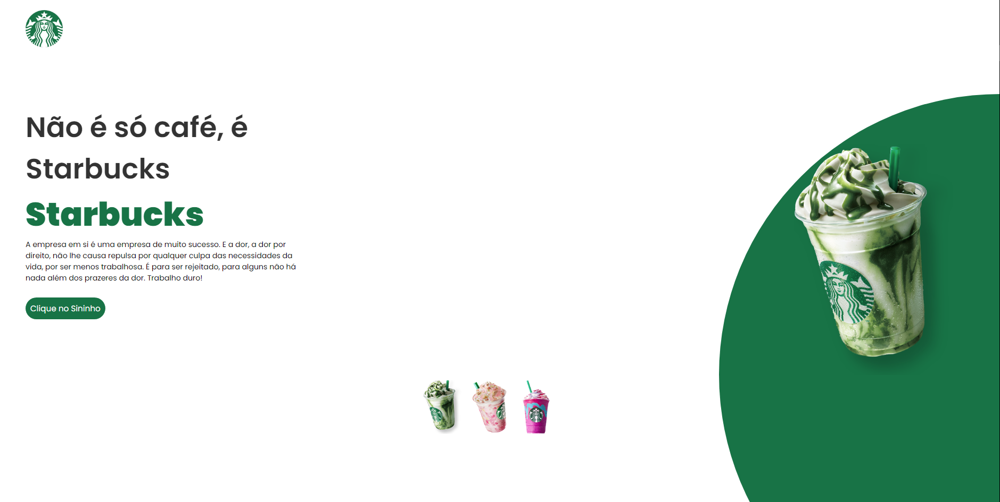

<h1 align="center"> Starbucks - Devclub </h1>

Programa exclusivo e gratuito, promovido pela DevClub | Programação para ensino de tecnologias WEB.  
<a href="https://rodolfomori.com.br/devclub/">Você aprenderá como desenvolver projetos reais que são solicitados pelo mercado de trabalho. clicando aqui.</a>

  <a href="#-tecnologias">Tecnologias</a>&nbsp;&nbsp;&nbsp;|&nbsp;&nbsp;&nbsp;
  <a href="#-projeto">Projeto</a>&nbsp;&nbsp;&nbsp;|&nbsp;&nbsp;&nbsp;
  <a href="#-layout">Layout</a>&nbsp;&nbsp;&nbsp;|&nbsp;&nbsp;&nbsp;
  <a href="#memo-licença">Licença</a>

  

 

## 🚀 Tecnologias

Esse projeto foi desenvolvido com as seguintes tecnologias:

- HTML
- CSS
- JavaScript
- Git e Github

## 💻 Projeto

O projeto visa à criação de uma página web, usando como inspiração a Starbucks.

- [Acesse o projeto finalizado, online](https://github.com/rodolfomori/starbucks-devclub)

- [Assistir aulas](https://www.youtube.com/@canaldevclub/streams)

## 🔖 Layout

Você pode visualizar a inspiração para layout do projeto através [DESSE LINK](https://www.starbucks.com.br/).

## :memo: Licença

Esse projeto está sob a licença MIT.

---

Feito com ♥ by DevClub - Rodolfo Mori :wave: [Participe dessa comunidade!](https://www.instagram.com/rodolfomorii/)
